# VigiLens - Silent. Secure. Seamless.

Elevate your recording experience with VigiLens - the most sophisticated background video recording solution for Android.

<div align="center">

  
 

`````
 __      __ _        _ _                    
 \ \    / /(_) __ _ (_) |     ___ _ __  ___ 
  \ \  / / | |/ _` || | |    / _ \ '_ \/ __|
   \ \/ /  | | (_| || | |___|  __/ | | \__ \
    \__/   |_|\__, ||_|_____|\___|_| |_|___/
              |___/                          
`````

[](../../releases)  
[](LICENSE)
[](../../releases)
[](https://developer.android.com/about/versions/oreo)  

</div>

> [!NOTE]
> 🎉 **Big News!** VigiLens is now open source! As of January 1st, 2025, we've made our entire codebase public to foster community collaboration and transparency.

## 🌟 What Makes VigiLens Special?

> [!TIP]
> VigiLens is designed with privacy and ease of use in mind. No Cloud Sync - your data stays on your device!

## Key Features That Set Us Apart

### 🔒 Absolute Privacy

* Zero internet connectivity for complete data security
* Local-only storage with password protection
* No data collection or external sharing
* Built-in App Lock

### ⚡ Performance Beast

* Minimal battery drain for extended recording
* Background recording with screen off
* Seamless multitasking capability
* Quick shortcuts for instant recording

### 🎥 Professional Grade

* Crystal clear HD/Full HD (1920x1080) recording
* Unlimited recording time with no restrictions
* Smart quality adaptation for storage optimization
* Silent recording mode for discretion
* Customizable recording preview options

### 🔐 Unique Features

* Screen Lock Icon ("⏻") for instant recording
* Automatic recording stop on screen unlock
* One-click gallery export
* Custom home screen shortcuts
* Intuitive user interface for all skill levels

## 📱 The VigiLens Experience

### Home Screen & Quick Start
<div align="center">
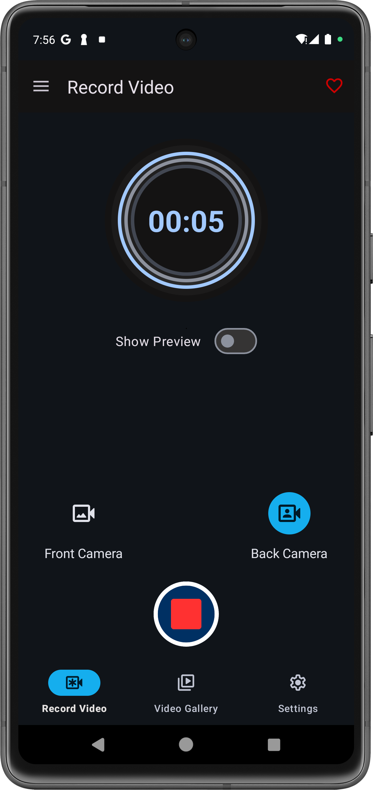

> [!TIP]
> The clean, intuitive interface puts all controls at your fingertips
</div>

### Live Preview & Recording
<div align="center">
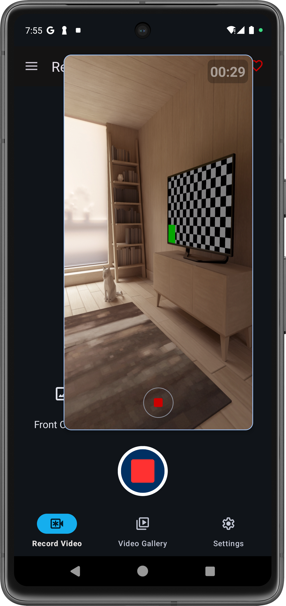

> [!NOTE]
> Real-time preview available while recording
</div>

### Video Management
<div align="center">
<table>
<tr>
<td></td>
<td>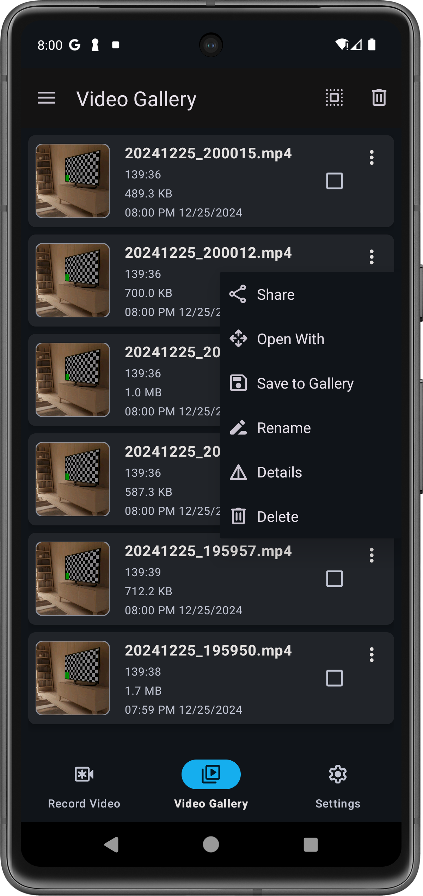</td>
<td>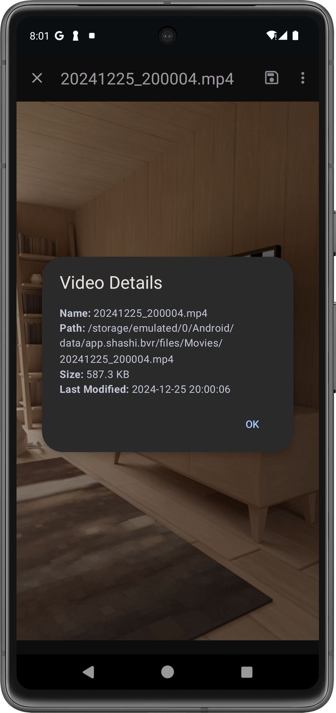</td>
</tr>
</table>

> [!TIP]
> Manage, organize, and protect your recordings with ease
</div>

### Quick Access & Controls
<div align="center">
<table>
<tr>
<td>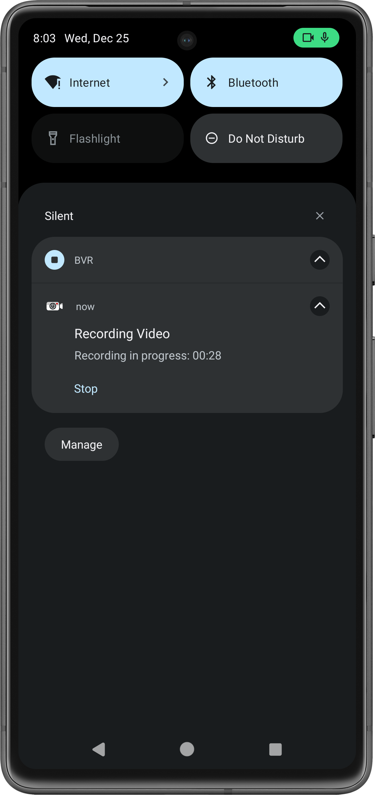</td>
<td>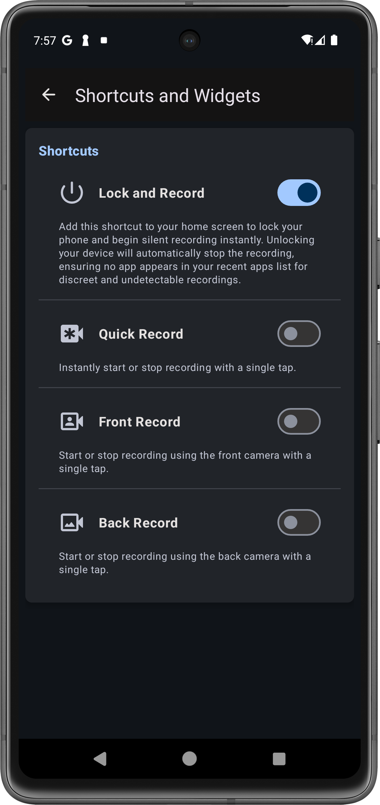</td>
<td>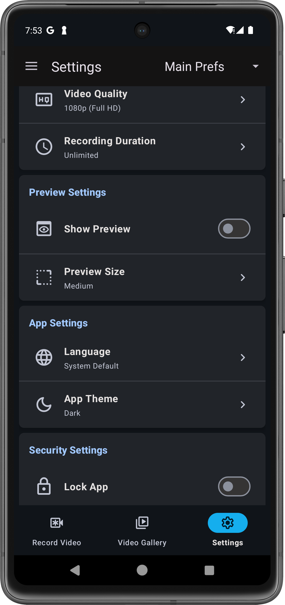</td>
</tr>
</table>

> [!NOTE]
> Multiple ways to control recording - choose what works best for you
</div>

## 🚀 Getting Started

### System Requirements

> [!IMPORTANT]
> Before installation, ensure your device meets these requirements:
> - Android 8.0 or higher
> - Minimum 50MB free storage
> - Camera and audio permissions
> - Notification permission

### Permission Setup
<div align="center">
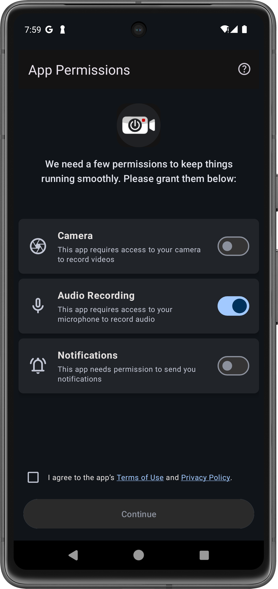

> [!CAUTION]
> All permissions are used locally and are essential for proper functioning
</div>

### Installation Methods

1. **Official Website** (Recommended)
   ```
   https://vigilens.shashi.app/download
   ```

2. **GitHub Releases**
   - [Stable Release](../../releases/latest)
   - [Beta Channel](https://vigilens.shashi.app/download/beta)

3. **Build from Source**
   ```bash
   # Clone the VigiLens repository from GitHub to your local machine
   git clone https://github.com/ShashiLab/VigiLens.git
   # Change directory to the cloned VigiLens project
   cd VigiLens
   # Build the project and assemble the release version using Gradle
   # This command compiles the code and creates a release APK (or artifact)
   ./gradlew assembleRelease
   ```

## 📖 Quick Start Guide

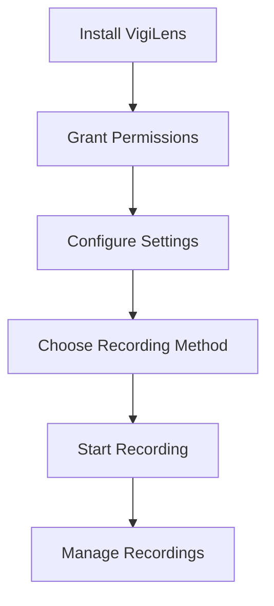

### Recording Methods

| Method | Activation | Best For |
|--------|------------|----------|
| Power Button (⏻) Shortcut | Screen lock | This will lock your screen and quickly start recording. When you unlock screen, recording will automatically stop to maintain discreet silent recording |
| Widget | Home screen tap | Regular use / Quick Record |
| In-App | App interface | Full control |

## ⚙️ Advanced Features

# Recording Modes

> [!TIP]
> Choose the mode that best fits your needs:

| Resolution | Description |
|------------|-------------|
| 144p | Basic low-resolution recording, suitable for minimizing file size and data usage |
| 240p | Improved clarity over 144p while maintaining small file size |
| 360p | Standard definition recording, balanced quality and size |
| 480p | Enhanced standard definition with sharper detail |
| 720p HD | High definition recording with excellent clarity |
| 1080p Full HD | Full high definition recording with maximum detail |
| Full Potential | Automatically selects optimal recording settings based on your device capabilities and available storage |

> [!NOTE]
> Higher resolutions require more storage space and processing power. Consider your device specifications and storage capacity when selecting a recording mode.

### Storage Management

> [!IMPORTANT]
> Enable automatic cleanup to prevent storage issues:

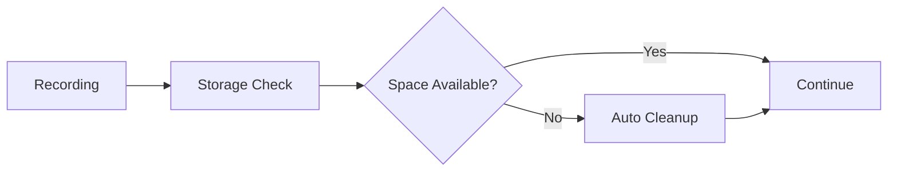

## 🛠️ Development Guide

### Development Setup

```bash
# Required tools
- Android Studio Arctic Fox+
- JDK 11+
- Android SDK 30+
- Gradle 7.0+

# Setup steps
1. Fork repository
2. Clone locally
3. Open in Android Studio
4. Sync Gradle
5. Build project
```

### Project Structure

```
          VigiLens
            ├── VigiLens.java
            ├── about
            │   └── AboutActivity.java
            ├── core
            │   ├── notification
            │   │   └── UrgentAnnouncementManager.java
            │   └── permission
            │       └── PermissionActivity.java
            ├── feature
            │   ├── gallery
            │   │   ├── adapter
            │   │   │   └── VideoAdapter.java
            │   │   ├── service
            │   │   │   └── VideoSaveService.java
            │   │   ├── ui
            │   │   │   ├── GalleryFragment.java
            │   │   │   ├── GalleryViewModel.java
            │   │   │   └── VideoPlayerActivity.java
            │   │   └── util
            │   │       └── VideoSaver.java
            │   ├── main
            │   │   ├── DrawerNavigationManager.java
            │   │   └── MainActivity.java
            │   ├── recording
            │   │   ├── service
            │   │   │   └── VideoRecordingService.java
            │   │   ├── ui
            │   │   │   ├── FloatingPreviewView.java
            │   │   │   ├── RecordingFragment.java
            │   │   │   └── RecordingViewModel.java
            │   │   └── util
            │   │       ├── CameraSettings.java
            │   │       ├── MediaRecorderManager.java
            │   │       └── NotificationManager.java
            │   ├── security
            │   │   ├── DisablePasswordActivity.java
            │   │   ├── EnterPasswordActivity.java
            │   │   ├── ResetPasswordActivity.java
            │   │   └── SetPasswordActivity.java
            │   ├── settings
            │   │   ├── SettingsFragment.java
            │   │   ├── SettingsViewModel.java
            │   │   └── quickaccess
            │   │       ├── ShortcutsSettingsActivity.java
            │   │       └── ShortcutsSettingsViewModel.java
            │   ├── shortcut
            │   │   ├── back
            │   │   │   └── BackRecordActivity.java
            │   │   ├── front
            │   │   │   └── FrontRecordActivity.java
            │   │   ├── lockscreen
            │   │   │   └── LockAndRecordActivity.java
            │   │   └── quick
            │   │       └── QuickRecordActivity.java
            │   └── widget
            │       ├── back
            │       │   └── BackRecordWidgetProvider.java
            │       ├── front
            │       │   └── FrontRecordWidgetProvider.java
            │       ├── lockscreen
            │       │   └── LockAndRecordWidgetProvider.java
            │       └── quick
            │           └── QuickRecordWidgetProvider.java
            ├── support
            │   ├── FeedbackActivity.java
            │   └── ReportBugActivity.java
            └── utils
                ├── CommonUtils.java
                ├── DeviceUtils.java
                ├── admin
                │   └── DeviceAdminManager.java
                ├── broadcast
                │   └── RecordingStopReceiver.java
                ├── feedback
                │   └── GitHubRatingManager.java
                └── locale
                    └── LocaleManager.java
```

## 🔒 Security Features

> [!CAUTION]
> Always enable device encryption and the built-in app lock for maximum security!

- **Secure File System**: All recordings are stored within the app's internal storage, ensuring no external exposure.  
- **Privacy-Focused Design**: Built to prioritize user privacy.

### Permission Usage

| **Permission** | **Purpose**        | **Usage**        |
|-----------------|--------------------|------------------|
| CAMERA          | Video capture      | For recording only. |
| AUDIO           | Sound recording    | Optional.           |
| NOTIFICATION    | Show notifications | Used for event alerts. |

## 📞 Support Channels

### Getting Help

- 📚 [Documentation](https://vigilens.shashi.app/docs)
- ❓ [FAQ](https://vigilens.shashi.app/faq)
- 🐛 [Issue Tracker](../../issues)
- 📧 [Email Support](mailto:ShashiTheDev@gmail.com)

### Community

- GitHub Discussions
- Telegram Support Group

## 📄 Legal Information

> [!WARNING]
> Check local laws regarding video recording in your jurisdiction

- [Privacy Policy](https://vigilens.shashi.app/privacy-policy/)
- [Terms of Use](https://vigilens.shashi.app/terms-of-use/)
- [Security Policy](SECURITY.md)
- [GPL-3.0 License](LICENSE)

## 🌟 Roadmap

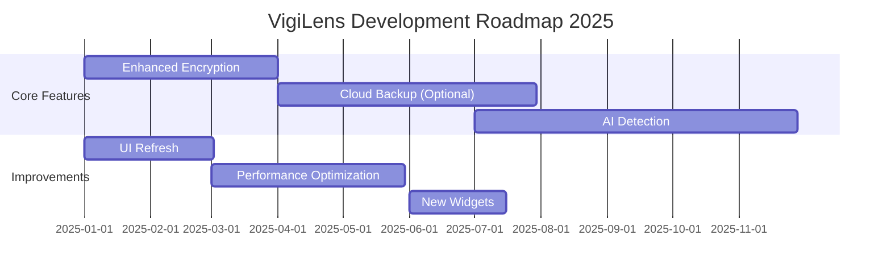

## ❤️ Acknowledgments

### Special Thanks To:

- Our amazing user community
- Open source contributors
- Beta testing team
- Android development community

> [!NOTE]
> Want to contribute? Check our [Contributing Guidelines](CONTRIBUTING.md)!

---

<div align="center">

Made with ❤️ by the VigiLens Team

[Website](https://vigilens.shashi.app) • [GitHub](https://github.com/ShashiLab/VigiLens) • [Report Issues](../../issues)

</div>